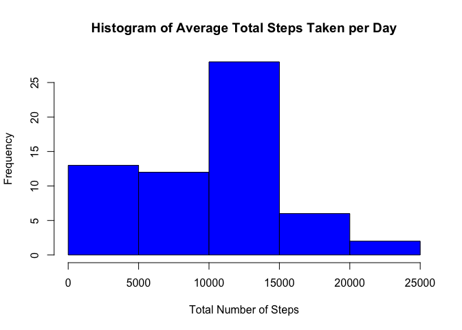

# Reproducible Research: Peer Assessment 1


```r
setwd("~/Desktop/Coursera-GitHub/RepData_PeerAssessment1")
library(ggplot2)
```

## Loading and preprocessing the data

```r
activityData <- read.csv("activity.csv")
activityData$steps <- as.numeric(activityData$steps)
activityData$date <- as.Date(activityData$date)
```


## What is mean total number of steps taken per day?

```r
stepsTotal <- tapply(activityData$steps, activityData$date, sum)
activityDataTotal <- na.omit(data.frame(unique(activityData$date), stepsTotal))
names(activityDataTotal) <- c("date", "stepsTotal")
hist(activityDataTotal$stepsTotal, main = "Histogram of Average Total Steps Taken per Day", xlab = "Total Number of Steps", ylab = "Frequency", col = "blue")
```

<!-- -->

```r
mean(activityDataTotal$stepsTotal)
```

```
## [1] 10766.19
```

```r
median(activityDataTotal$stepsTotal)
```

```
## [1] 10765
```


## What is the average daily activity pattern?

```r
stepsMean <- tapply(activityData$steps, activityData$interval, mean, na.rm = TRUE)
plot(row.names(stepsMean), stepsMean, type = "l", main = "Time Series Plot of Average Steps per Day (5-minute Intervals)", xlab = "Intervals", ylab = "Average Number of Steps", col = "purple")
```

<!-- -->

```r
names(which.max(stepsMean))
```

```
## [1] "835"
```


## Imputing missing values

```r
sum(is.na(activityData$steps))
```

```
## [1] 2304
```

```r
intervalSteps <- aggregate(steps ~ interval, activityData, mean)
for(i in 1:nrow(activityData)){
  if(is.na(activityData$steps[i])){
    activityData$steps[i] <- intervalSteps$steps[which(intervalSteps$interval == activityData$interval[i])]
  }
}

stepsTotalImputed <- tapply(activityData$steps, activityData$date, sum, na.rm = TRUE)
activityDataTotalImputed <- data.frame(unique(activityData$date), stepsTotalImputed)

hist(activityDataTotalImputed$stepsTotalImputed, main = "Histogram of Average Total Steps Taken per Day (Imputed)", xlab = "Total Number of Steps", ylab = "Frequency", col = "turquoise")
```

<!-- -->

```r
mean(activityDataTotalImputed$stepsTotalImputed)
```

```
## [1] 10766.19
```

```r
median(activityDataTotalImputed$stepsTotalImputed)
```

```
## [1] 10766.19
```


## Are there differences in activity patterns between weekdays and weekends?

```r
activityData["day"] <- as.character(weekdays(activityData$date))
activityData["dayLevel"] <- activityData$day

for(i in 1:nrow(activityData)){
  if(activityData$day[i] %in% c("Saturday", "Sunday")){
    activityData$dayLevel[i] <- "Weekend"
  } else {
    activityData$dayLevel[i] <- "Weekday"
  }
}

activityData$dayLevel <- as.factor(activityData$dayLevel)
activityData["stepsMeanDays"] <- tapply(activityData$steps, activityData$interval, mean, na.rm = TRUE)

g <- qplot(x = interval, y = stepsMeanDays, data = activityData, geom = "line", col = "red") + facet_wrap(~ dayLevel, ncol = 1)  + ggtitle("Average Steps Taken, Averaged Over Weekday Days and Weekend Days") + xlab("Interval") + ylab("Average Number of Steps")
print(g)
```

<!-- -->
